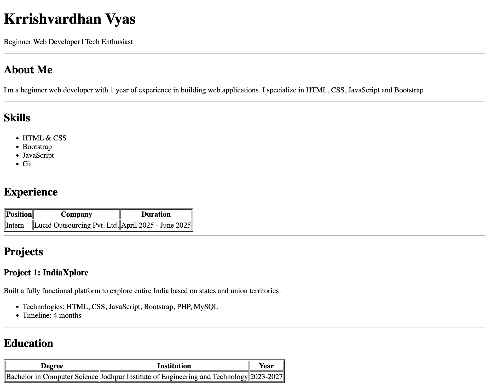

# HTML Resume
## Description

This is a single-page HTML resume showcasing my skills, experience, projects, and education.

## Features

- Personal information and introduction
- Skills list
- Work experience table
- Project showcase
- Education details
- Contact information

## Technologies Used

- HTML5

## How to Use

1. Clone this repository
2. Open `index.html` in your web browser
3. That's it!

## Screenshots

## Contact

- **Email**: vyaskrrishvardhan@gmail.com
- **Phone**: +91 8079069420
- **Location**: Jodhpur, Rajasthan

---

© 2026 Krrishvardhan Vyas. All rights reserved.